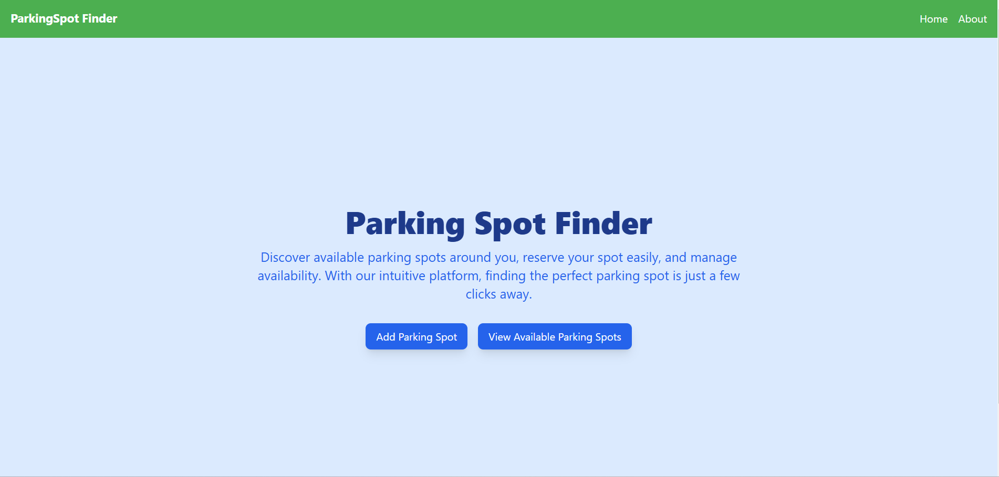
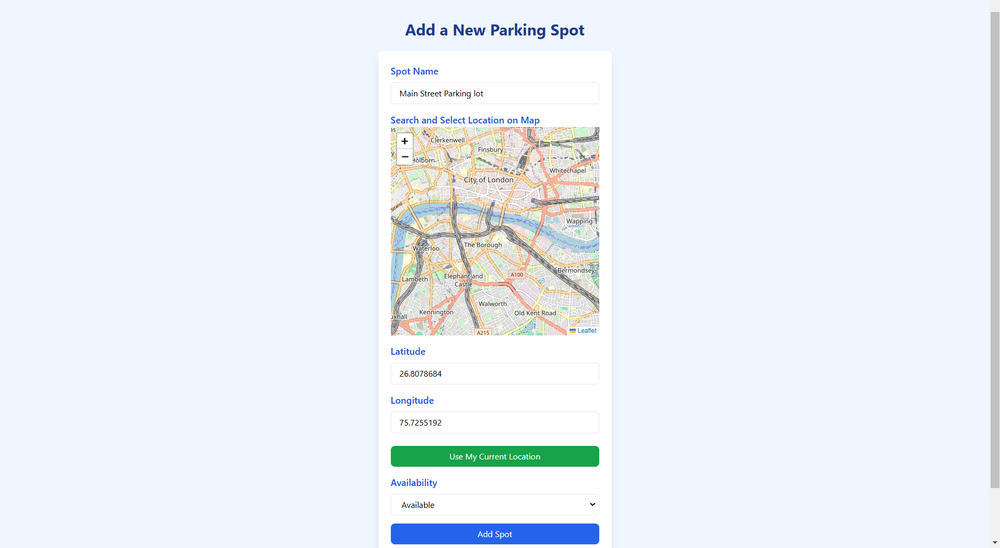
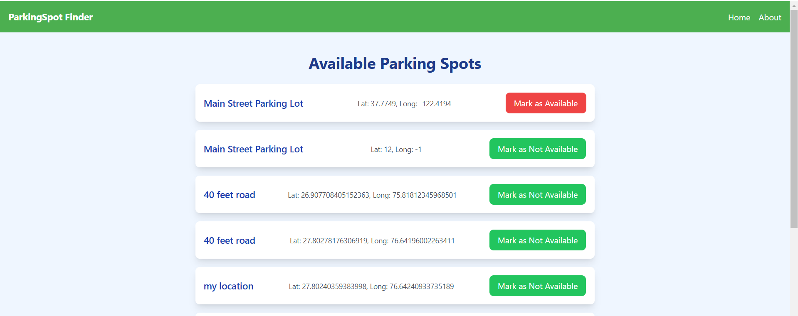

# Parking Spot Finder

**Parking Spot Finder** is a web app that helps users find and manage available parking spots in real-time. Users can add new parking spots, view available ones, and update their status (available/not available). With a sleek and responsive UI, this app simplifies parking management for both users and admins.

## Features
- **Add Parking Spot**: Easily add new parking spots with details such as name, latitude, longitude, and availability.
- **View Available Parking Spots**: List available parking spots with the ability to update their availability status.
- **Responsive Design**: Fully responsive for mobile and desktop views.

## Tech Stack
- **Frontend**: React, TypeScript, Tailwind CSS
- **Backend**: Node.js, Express, MongoDB

## Deployement
- **Production Frontend**: Deployed on Netlify
- **Production Backend**: Deployed on Vercel

## Installation
### Frontend Setup
1. Clone the repository:
   ```bash
   git clone https://github.com/BHAGTANIDEEPAK/ParkingSpotFinder.git
   ```
2. Navigate to the frontend folder:
   ```bash
   cd frontend/frontend
   ```
3. Install dependencies:
   ```bash
   npm install
   ```
4. Start the frontend:
   ```bash
   npm start
   ```
5. Open your browser and go to:
   ```
   http://localhost:3000
   ```

### Backend Setup
1. Navigate to the backend folder:
   ```bash
   cd backend
   ```
2. Create a `.env` file in the backend folder and add your MongoDB connection URL:
   ```
   MONGO_URI=your-mongodb-connection-url
   ```
3. Install dependencies:
   ```bash
   npm install
   ```
4. Start the backend:
   ```bash
   npm start
   ```

## Notes
- Ensure MongoDB is running and accessible before starting the backend.
- Both frontend and backend need to be running simultaneously for the full application functionality.

## Screenshots





